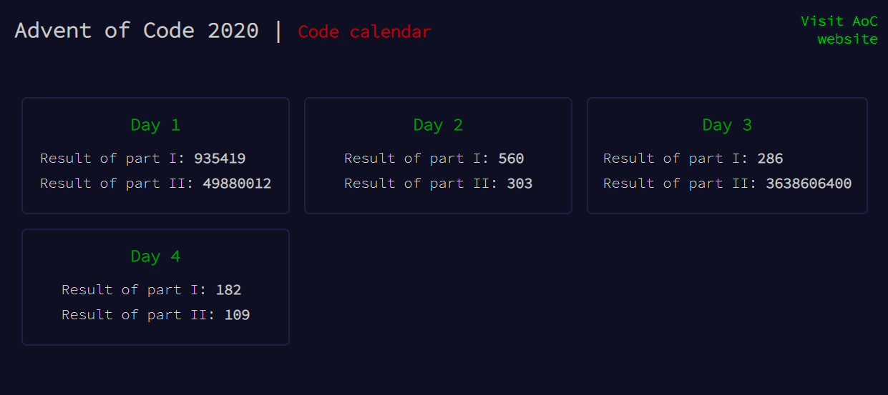

# Advent of Code - code calendar

This is a small and ultra-simple project that keeps track your journey through **Advent of Code** (only if you code in JavaScript). Keep all your results in one place on design-consistently (local) website, as a great memory of the challenge.

Take part at [Advent of Code website](https://adventofcode.com/)

## Usage

1. Create a new variable with your input in file `inputs.js`. Probably you need to edit it to be a string or an array in order to be able to parse it comfortably.
1. Create new day file - you can copy `/days/Template.js` and follow istructions inside it,
1. Write resolutions of the current day's task,
1. Add newly created file to index.html.

;

## Editing

There aro no special requirements for editing on your own. Just a sass compiler might be helpful if you don't want to mess with pure css. 

In case you decide to use compiler, make sure, the target folder for compiled files is `styles/compiled`, or change style link path in `index.html`.
